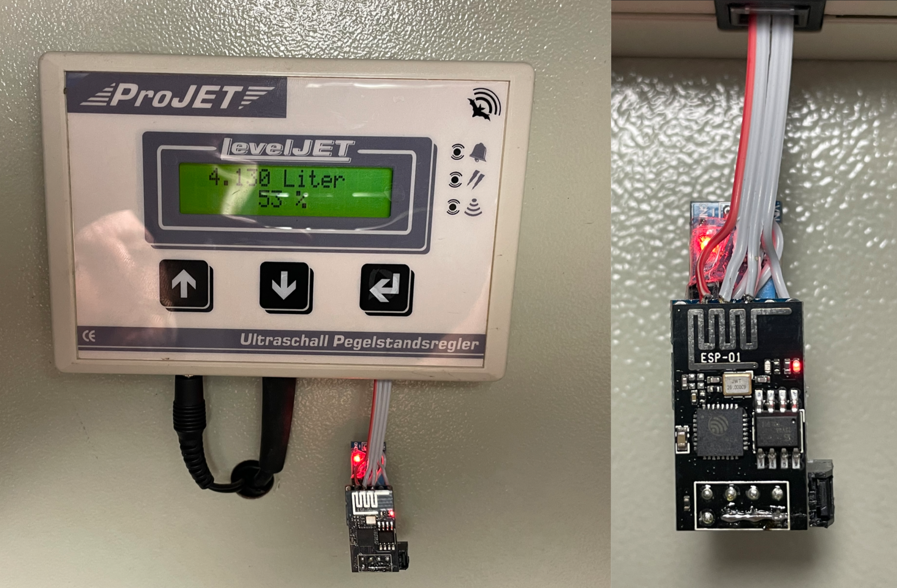
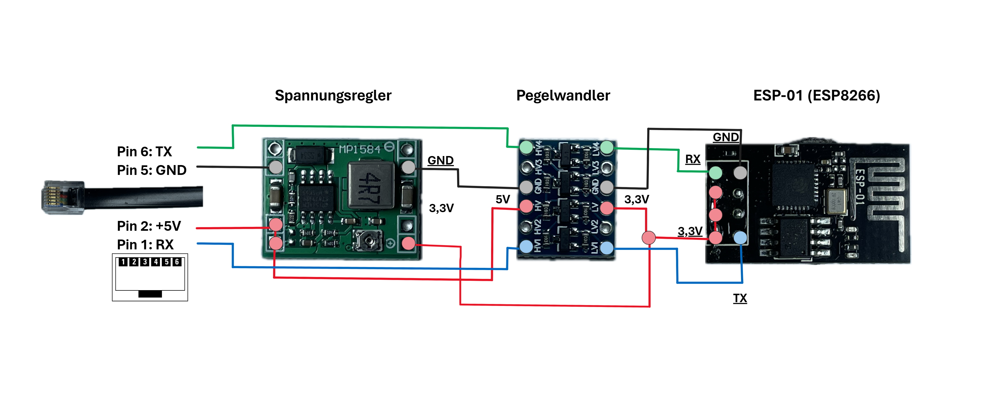

# LevelJET-MQTT-ESPController

## Über das Projekt
Dieses Projekt ermöglicht die Anbindung eines LevelJET Füllstandmessgeräts an ein MQTT-Netzwerk mittels eines ESP8266 Mikrocontrollers. Es liest die Daten vom LevelJET-Gerät über eine serielle Verbindung und veröffentlicht die Messwerte über MQTT. Dies ermöglicht die Integration in Smart Home Systeme oder andere IoT-Anwendungen.

### Hauptfunktionen

- **Statusüberwachung:** Sendet Statusobjekte wie mit Füllstandsinformationen und Zustände der im LevelJET konfigurierbaren Hysteresenschalter.

### Schnelleinrichtung

1. **Arduino IDE:** Öffne `LevelJET-MQTT-ESPController.ino` in der Arduino IDE.
2. **Konfiguration:** Gib SSID, Passwort und die IP-Adresse des MQTT-Brokers an.
3. **Flashen:** Lade den Code auf den ESP-Mikrocontroller.
4. **Hardware-Anschluss:** Verbinde die Hardware gemäß dem bereitgestellten Schaltplan mit dem RJ12-Port des LevelJET.
5. **Fertig:** Dein System ist einsatzbereit!

ACHTUNG! Grundsätzlich gilt: Nutzung auf eigenes Risiko!!!

## Technische Details
- **Mikrocontroller**: ESP8266
- **Schnittstellenkonverter**: MAX3232
- **Pegelwandler**: 5V auf 3,3V
- **Kommunikation**: RJ12 Kabel
- **Entwicklungsumgebung**: Arduino IDE

## MQTT-Datenpunkte

### MQTT Subscribe Topics
- `LevelJET/cmd/sendezyklus`: Setzt das Intervall für den automatischen Sendevorgang (in Sekunden).

### MQTT Publish Topics

- `LevelJET/status/Kennung`: Gerätekennung.
- `LevelJET/status/Distanz`: Distanz.
- `LevelJET/status/Füllhöhe`: Füllhöhe.
- `LevelJET/status/Liter`: Liter.
- `LevelJET/status/Inhalt_Prozent`: Inhalt in Prozent.
- `LevelJET/status/Ausgang1`: Zustand der Ausgang 1.
- `LevelJET/status/Ausgang2`: Zustand der Ausgang 2.
- `LevelJET/status/sendezyklus`: Zykluszeit.

## Installation

### Voraussetzungen

- Ein ESP8266 Mikrocontroller.
- LevelJET Füllstandmessgerät.
- Arduino IDE.

### Setup

1. Laden Sie den Code auf Ihren ESP8266 Mikrocontroller hoch, nachdem Sie ihn entsprechend Ihrer Netzwerk- und MQTT-Broker-Konfiguration angepasst haben.
2. Stellen Sie sicher, dass Ihr LevelJET-Gerät korrekt angeschlossen ist und Daten sendet.

## Konfiguration

Im Code müssen Sie die folgenden Einstellungen anpassen:

- `ssid` und `password` für Ihre WLAN-Verbindung.
- `mqtt_Server`, `mqttPort`, `mqttUser`, und `mqttPassword` für die Verbindung zu Ihrem MQTT-Broker.
- `OTA_HOSTNAME` und `OTA_PASSWORD` für OTA-Updates.

Siehe `config.h` für weitere Konfigurationsmöglichkeiten.

## Benutzung

Nach der erfolgreichen Installation und Konfiguration verbindet sich der ESP8266 mit Ihrem WLAN und dem MQTT-Broker. Der Controller abonniert MQTT-Topics für Befehle und veröffentlicht Daten von Ihrem LevelJET-Gerät unter `LevelJET/status/`.

Sie können die Zykluszeit für das Senden der Daten über das Topic `LevelJET/cmd/sendezyklus` anpassen.

## Protokollbeschreibung

Die Kommunikation zwischen dem LevelJET-Gerät und dem ESP8266 erfolgt über eine serielle Schnittstelle mit folgenden Parametern:

- Geschwindigkeit: 19200 Baud
- Datenbits: 8
- Parität: Keine
- Stopbits: 1

Ein Datenblock umfasst 12 Bytes, davon 10 Datenbytes und zwei CRC-Bytes. Die Zuordnung der Datenbytes ist wie folgt:

- 0-1: Gerätekennung
- 2-3: Distanz
- 4-5: Füllhöhe
- 6-7: Liter
- 8: Inhalt in Prozent
- 9: Zustand der Ausgänge
- 10-11: CRC

## Dokumentation und Ressourcen
- [Protokollbeschreibung LevelJET](http://www.projet.de/Software/Leveljet_seriell.pdf)
- [Bedienungsanleitung LevelJET](http://www.projet.de/Software/LevelJET_ST.pdf)

## Beitragen

Fühlen Sie sich frei, zum Projekt beizutragen. Jede Hilfe bei der Entwicklung, Dokumentation oder beim Testen ist willkommen. Bitte erstellen Sie Pull Requests für Ihre Beiträge.

## Lizenz

Dieses Projekt ist unter der MIT-Lizenz lizenziert. Siehe die LICENSE-Datei im Repository für die vollständigen Lizenztexte.
